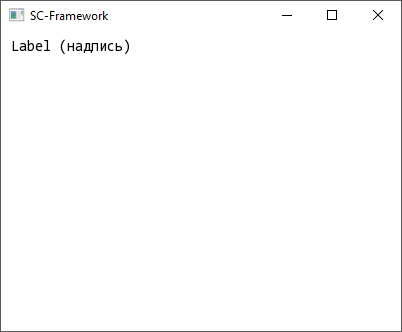
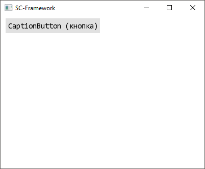
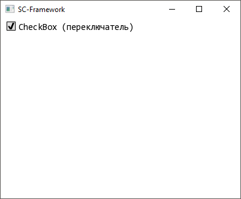
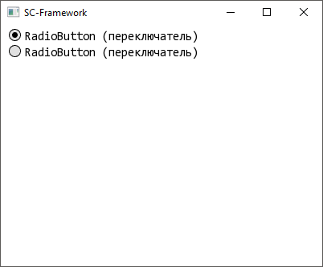
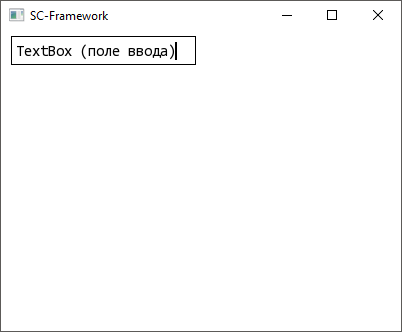
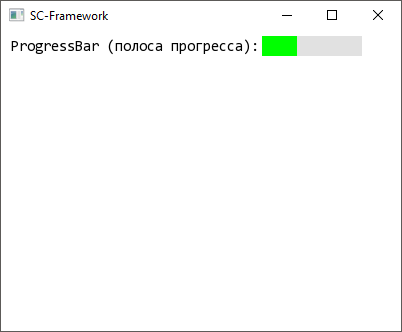
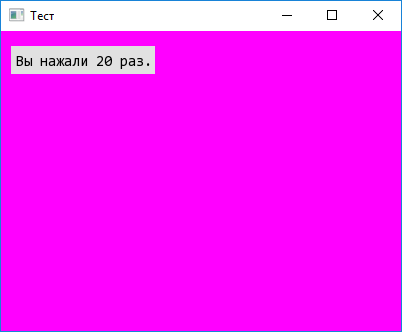

<h1 align="center"> SC Framework </h1>
SimpleControl Framework - фреймворк, содержащий в себе базовые элементы управления пользовательского интерфейса. Фреймворк основан на библиотеке SFML/С++.

# Оглавление
- [Установка](#установка)
- [Начало работы](#начало-работы)
- [Документация API](#Документация-API)
- [Базовые классы](#Базовые-классы)
  - [PositionSize](#PositionSize)
  - [IsIn](#IsIn)
  - [Enable](#Enable)
  - [Visible](#Visible)
  - [Checked](#Checked)
  - [ActiveColor](#ActiveColor)
  - [RenderWindowElement](#RenderWindowElement)
  - [Caption](#Caption)
  - [Background](#Background)
  - [Click](#Click)
- [Элементы управления](#Элементы-управления)
  - [Label](#Label)
  - [CaptionButton](#CaptionButton)
  - [CheckBox](#CheckBox)
  - [RadioButton](#RadioButton)
  - [RadioButtonContainer](#RadioButtonContainer)
  - [TextBox](#TextBox)
  - [ProgressBar](#ProgressBar)
- [Пример использования](#Пример-использования)

# Установка
Для работы библиотеки необходимо наличие в проекте установленной, вышеупомянутой, библиотеки SFML. Инструкция по установки библиотеки [здесь](https://www.sfml-dev.org/tutorials/2.5/start-vc.php).

# Начало работы
Подключение осуществляется через заголовок файла: `#include "SFC.h";`. Далее создайте следующую структуру, которая является стандартной для данного фреймворка:

```c++
#include "SCF.hpp"

/*Создание окна*/
sf::RenderWindow window(VideoMode(400, 300), "Testing", Style::Default);

/*Создание объектов*/
sf::Font font;
Label label(window, font);

/*Инициализация компонентов*/
void InitializeComponents()
{
	/* Загрузка шрифта */
	font.loadFromFile("Consolas.ttf");

	/* Установка свойств для объектов*/
	label.setCaption("Hello, SC-Framework!");
	label.setPosition(10, 10);
}

/*Стандартный SFML цикл*/
int main()
{
	InitializeComponents();

	while (window.isOpen())
	{
		Event event;
		while (window.pollEvent(event))
		{
			if (event.type == Event::Closed)
				window.close();
		}

		window.clear(sf::Color::White);
		label.display(); // Выводит надпись
		window.display();
	}
}
```
Данная структура самая оптимальная для использования фреймвока. Глобализация компонентов необходима для более легкой видимости. К примеру, это пригодится при установки событийных методов или процедур.

# Документация API
Изначально фреймворк имеет базовые классы из которых состоит основа каждого элемента.

Базовые классы:
1. PositionSize - класс, передающий свойства размера и позиции элемента.
2. IsIn - передает методы, определяющие нахождение курсора относительно элемета.
3. isEnabled - доступность элемента.
4. Visible - видимость элемента.
5. Checked - "включенность" элемента.
6. ActiveColor - цвета состояний.
7. RenderWindowElement - передает поля и методы необходимые для работы с окнами.
8. Caption - поля и свойства для изменения надписей элемента.
9. Background - поля и свойства для изменения тела или заднего фона элемента.
10. Click - класс, используемый для определния нажатия на элемент.

Фремворк имеет следующие элементы управления, которые основаны на базовых классах:
1. Label - простая надпись.
2. CaptionButton - кнопка с надписью.
3. CheckBox - переключатель с меткой.
4. RadioButton - переключатель между несколькими подобными элементами.
5. RadioButtonContainer - контейнер для переключателей RadioButton.
6. TextBox - поле ввода текста.
7. ProgressBar - полоса отображения выполненного прогресса в процентах.

## Базовые классы

### PositionSize
Класс предназначен для добавления позиции и размеров. После изменения одного из параметров (к примеру размера) будет вызвана соответствующая процедура:
 - изменение позиции - `position_update();`
 - изменение размера - `size_update();`

Изначально данные процедуры являются виртуальными (не имеют тела).

#### Защищенные методы и поля
| Тип            | Метод / Поле                                                                                               |
| :------------- | :--------------------------------------------------------------------------------------------------------- |
| `sf::Vector2f` | `position` <br> Поле позиции элемента.                                                                     |
| `sf::Vector2f` | `size` <br> Поле размера элемента.                                                                         |
| `virtual void` | `position_update() = 0` <br> Процедура вызываемая при изменении позиции (после вызова `setPosition(...)`). |
| `virtual void` | `size_update() = 0` <br> Процедура вызываемая при изменении размера (после вызова `setSize(...)`).         |

#### Открытые методы и поля
| Тип            | Метод / Поле                                                                                                                                                                                                                                |
| :------------- | :------------------------------------------------------------------------------------------------------------------------------------------------------------------------------------------------------------------------------------------ |
| `virtual void` | `setPosition(sf::Vector2f position)` <br> Метод изменния позиции элемента. <br><br> **Параметры:** <br> - `sf::Vector2f position`: обновленная позиция элемента.                                                                            |
| `void`         | `setPosition(float position_x, float position_y)` <br> Метод изменния позиции элемента. <br><br> **Параметры:** <br> - `float position_x`: обновленная позиция элемента по X. <br> - `float position_y`: обновленная позиция элемента по Y. |
| `sf::Vector2f` | `getPosition()` <br> Возвращает текущую позицию элемента.                                                                                                                                                                                   |
| `virtual void` | `setSize(sf::Vector2f size)` <br> Метод изменния размера элемента. <br><br> **Параметры:** <br> - `sf::Vector2f size`: обновленный размер элемента.                                                                                         |
| `void`         | `setSize(float size_x, float size_y)` <br> Метод изменния размера элемента. <br><br> **Параметры:** <br> - `float size_x`: обновленный размер элемента по X <br> - `float size_y`: обновленный размер элемента по Y                         |
| `sf::Vector2f` | `getSize()` <br> Возвращает текущий размер элемента.                                                                                                                                                                                        |

### IsIn 
Класс предназначен для определение позции курсора относительно элемента.

#### Примечания:
1. Является дочерним классом класса `PositionSize`.

#### Защищенные методы и поля
| Тип            | Метод / Поле                                                                                               |
| :------------- | :--------------------------------------------------------------------------------------------------------- |
| `sf::Vector2f` | `position` <br> Поле позиции элемента.                                                                     |
| `sf::Vector2f` | `size` <br> Поле размера элемента.                                                                         |
| `virtual void` | `position_update() = 0` <br> Процедура вызываемая при изменении позиции (после вызова `setPosition(...)`). |
| `virtual void` | `size_update() = 0` <br> Процедура вызываемая при изменении размера (после вызова `setSize(...)`).         |

#### Открытые методы и поля
| Тип            | Метод / Поле                                                                                                                                                                                                                                |
| :------------- | :------------------------------------------------------------------------------------------------------------------------------------------------------------------------------------------------------------------------------------------ |
| `virtual bool` | `isIn(sf::Vector2f current_position)` <br> Метод, определяющий находится ли точка `current_position` в координатах элемента. <br><br> **Параметры:** <br> - `sf::Vector2f current_position`: точка, определяющая вхождение в элемент.       |
| `virtual bool` | `isIn(sf::Vector2i current_position)` <br> Метод, определяющий находится ли точка `current_position` в координатах элемента. <br><br> **Параметры:** <br> - `sf::Vector2i current_position`: точка, определяющая вхождение в элемент.       |
| `virtual void` | `setPosition(sf::Vector2f position)` <br> Метод изменния позиции элемента. <br><br> **Параметры:** <br> - `sf::Vector2f position`: обновленная позиция элемента.                                                                            |
| `void`         | `setPosition(float position_x, float position_y)` <br> Метод изменния позиции элемента. <br><br> **Параметры:** <br> - `float position_x`: обновленная позиция элемента по X. <br> - `float position_y`: обновленная позиция элемента по Y. |
| `sf::Vector2f` | `getPosition()` <br> Возвращает текущую позицию элемента.                                                                                                                                                                                   |
| `virtual void` | `setSize(sf::Vector2f size)` <br> Метод изменния размера элемента. <br><br> **Параметры:** <br> - `sf::Vector2f size`: обновленный размер элемента.                                                                                         |
| `void`         | `setSize(float size_x, float size_y)` <br> Метод изменния размера элемента. <br><br> **Параметры:** <br> - `float size_x`: обновленный размер элемента по X <br> - `float size_y`: обновленный размер элемента по Y                         |
| `sf::Vector2f` | `getSize()` <br> Возвращает текущий размер элемента.                                                                                                                                                                                        |

### Enable
Класс, котрый указывает доступность элемента и изменение этого свойства.

#### Защищенные методы и поля
| Тип    | Метод / Поле                                        |
| :----- | :-------------------------------------------------- |
| `bool` | `is_enabled = true` <br> Поле доступности элемента. |

#### Открытые методы и поля
| Тип    | Метод / Поле                                                                                               |
| :----- | :--------------------------------------------------------------------------------------------------------- |
| `bool` | `isEnabled()` <br> Возвращает значение `true` или `false` в зависимости от того, доступен элемент или нет. |
| `void` | `enable()` <br> Устанавливет полю `is_enabled` значение `true`.                                            |
| `void` | `unable()` <br> Устанавливет полю `is_enabled` значение `false`.                                           |

### Visible
Устанавливает видимость элемента.

#### Защищенные методы и поля
| Тип    | Метод / Поле                                      |
| :----- | :------------------------------------------------ |
| `bool` | `is_visible = true` <br> Поле видимости элемента. |

#### Открытые методы и поля
| Тип    | Метод / Поле                                                                                            |
| :----- | :------------------------------------------------------------------------------------------------------ |
| `bool` | `isVisible()` <br> Возвращает значение `true` или `false` в зависимости от того, видим элемент или нет. |
| `void` | `visible()` <br> Устанавливет полю `is_visible` значение `true`.                                        |
| `void` | `invisible()` <br> Устанавливет полю `is_visible` значение `false`.                                     |

### Checked
Добавляет информации об отмеченности элемента (отмечен он или нет, к примеру, меткой).

#### Примечания:
1. Имеет дружественный класс `RadioButtonContainer`.

#### Защищенные методы и поля
| Тип    | Метод / Поле                                          |
| :----- | :---------------------------------------------------- |
| `bool` | `is_checked = false` <br> Поле отмеченности элемента. |

#### Открытые методы и поля
| Тип    | Метод / Поле                                                                                           |
| :----- | :----------------------------------------------------------------------------------------------------- |
| `bool` | `isChecked` <br> озвращает значение `true` или `false` в зависимости от того, отмечен элемент или нет. |
| `void` | `checked()` <br> Устанавливет полю `is_checked` значение `true`.                                       |
| `void` | `unchecked()` <br> Устанавливет полю `is_checked` значение `false`.                                    |

### ActiveColor
Добавлет 3 цвета основных состояний:
- `hovered` (наведен).
- `clicked` (нажат).
- `basic` (обычное состояние).

#### Открытые методы и поля
| Тип         | Метод / Поле                                                                                                                                                                                                                                                                                                                       |
| :---------- | :--------------------------------------------------------------------------------------------------------------------------------------------------------------------------------------------------------------------------------------------------------------------------------------------------------------------------------- |
| `sf::Color` | `hovered` <br> Поле цвета наведенного состояния.                                                                                                                                                                                                                                                                                   |
| `sf::Color` | `clicked` <br> Поле цвета нажатого состояния.                                                                                                                                                                                                                                                                                      |
| `sf::Color` | `basic` <br> Поле цвета обычного состояния.                                                                                                                                                                                                                                                                                        |
|             | `ActiveColor()` <br> Конструкор по умолчанию.                                                                                                                                                                                                                                                                                      |
|             | `ActiveColor(sf::Color basic, sf::Color clicked, sf::Color hovered)` <br> Конструктор, который устанавливает цвета для каждого состояния. <br><br> **Параметры:** <br> - `sf::Color basic`: цвет обычного состояния.  <br> - `sf::Color clicked`: цвет нажатого состояния. <br> - `sf::Color hovered`: цвет наведенного состояния. |

### RenderWindowElement
Добавляет поля и методы для привязки элемента к определенному окну.

#### Защищенные методы и поля
| Тип                 | Метод / Поле                                                                              |
| :------------------ | :---------------------------------------------------------------------------------------- |
| `sf::RenderWindow*` | `window = NULL` <br> Поле, хранящее в себе указатель на окно, к кторому привязан элемент. |

#### Открытые методы и поля
| Тип                 | Метод / Поле                                                                                                                                                                                  |
| :------------------ | :-------------------------------------------------------------------------------------------------------------------------------------------------------------------------------------------- |
| `sf::RenderWindow*` | `getWindow()` <br> Возвращает указатель на на окно, к кторому привязан элемент.                                                                                                               |
| `void`              | `setWindow(sf::RenderWindow &window)` <br> Устанавливет связь между окном и элементом. <br><br> **Параметры:** <br> - `sf::RenderWindow &window`: окно, к которому следует привязать элемент. |

### Caption
Добавляет элементу надпись. Надпись имеет таже настройки отображения. К примеру какой шрифт будет использован и какого цвета. После каждого изменения надписи вызываеся соответвующая процедура `caption_update()`. 

#### Защищенные методы и поля
| Тип            | Метод / Поле                                                                        |
| :------------- | :---------------------------------------------------------------------------------- |
| `sf::Text`     | `caption` <br> Поле, храняшее в себе отображаемый текст.                            |
| `virtual void` | `caption_update() = 0` <br> Метод, который вызывается при каждом изменении надписи. |

#### Открытые методы и поля
| Тип               | Метод / Поле                                                                                                                                                                                                                                                                                                                                                                          |
| :---------------- | :------------------------------------------------------------------------------------------------------------------------------------------------------------------------------------------------------------------------------------------------------------------------------------------------------------------------------------------------------------------------------------ |
| `void`            | `setCaption(std::wstring text)` <br> Метод, устанавливающий текст надписи. <br><br> **Параметры:** <br> - `std::wstring text`: текст, содержащий надпись.                                                                                                                                                                                                                             |
| `void`            | `setCaption(std::string text)` <br> Метод, устанавливающий текст надписи. <br><br> **Параметры:** <br> - `std::wstring text`: текст, содержащий надпись.                                                                                                                                                                                                                              |
| `sf::String`      | `getCaption()` <br> Метод, который возвращает текст, который содержит надпись.                                                                                                                                                                                                                                                                                                        |
| `void`            | `sf::setCaptionFont(sf::Font &font)` <br> Метод, который устанавливает новый шрифт для надписи. <br><br> **Параметры:** <br> - `sf::Font &font`: переменная содержащая в себе шрифт. <br><br> **Примечание:** <br> Так как устройство класса `sf::Text` имеет в себе особенность хранить указатель на шрифт, то шрфит должен быть постоянно доступен, во время использования надписи. |
| `const sf::Font*` | `getFont()` <br> Метод, который возвращает указатель на используемый в надписи шрифт.                                                                                                                                                                                                                                                                                                 |
| `void`            | `setCaptionStyle(sf::Uint32 style)` <br> Метод, который устанавливает стиль надписи. <br><br> **Параметры:** <br> - `sf::Uint32 style`: настройки стиля. <br><br> **Примечаение:** <br> Вы можете компбинировать стили. Например комбинация `label.setCaptionStyle(Text::Style::Bold | Text::Style::Italic);` установит ***жирную надпись с наклоном***.                              |
| `void`            | `setCaptionCharacterSize(unsigned int size)` <br> Метод, который устанавливает размер шрифта надписи. <br><br> **Параметры:** <br> - `unsigned int size`: размер шрифта надписи.                                                                                                                                                                                                      |
| `unsigned int`    | `getCaptionCharacterSize()` <br> Метод, который возвращает размер шрифта надписи.                                                                                                                                                                                                                                                                                                     |
| `void`            | `setCaptionOutlineThickness(float size)` <br> Метод, который устанавливает толщину обводящей линии надписи. <br><br> **Параметры:** <br> - `float size`: толщина обводки надписи. <br><br> **Примечание:** <br> Если установить отрицательное значение, то обводка будет внутри элемента, а не вне.                                                                                   |
| `float`           | `getCaptionOutlineThickness()` <br> Метод, который возвращает толщину обводящей линии.                                                                                                                                                                                                                                                                                                |
| `void`            | `setCaptionOutlineColor(sf::Color color)` <br> Метод, который устанавливает цвет обводящей линии надписи. <br><br> **Параметры:** <br> - `sf::Color color`: цвет обводки.                                                                                                                                                                                                             |
| `float`           | `getCaptionOutlineColor()` <br> Метод, который возвращает цвет обводящей линии.                                                                                                                                                                                                                                                                                                       |
| `void`            | `setCaptionColor(sf::Color color)` <br> Метод, который устанавливает цвет шрифта надписи. <br><br> **Параметры:** <br> - `sf::Color color`: цвет шрифта.                                                                                                                                                                                                                              |

### Background
Добавляет фон или так называемое *тело* для элемента. После каждого изменения фона элемента вызывается процедура `background_update()`.

#### Защищенные методы и поля
| Тип                  | Метод / Поле                                                                                                                              |
| :------------------- | :---------------------------------------------------------------------------------------------------------------------------------------- |
| `sf::RectangleShape` | `background` <br> Поле, хранящее в себе геометрическую фигуру фона элемента.                                                              |
| `virtual void`       | `background_update() = 0` <br> Метод, который вызвается после каждого изменения фона. <br><br> **Параметры:** <br> - `тип имя`: описание. |

#### Открытые методы и поля
| Тип    | Метод / Поле                                                                                                                               |
| :----- | :----------------------------------------------------------------------------------------------------------------------------------------- |
| `void` | `setBorderSize(float size)` <br> Метод, который изменяет размер рамки. <br><br> **Параметры:** <br> - `float size`: размер рамки фона.     |
| `void` | `setBackgroundColor(sf::Color color)` <br> Метод, который изменяет цвет фона. <br><br> **Параметры:** <br> - `sf::Color color`: цвет фона. |

### Click
Добавляет к элементу возможность нажатия на него курсором мыши.

#### Примечания:
1. Является производным классом `IsIn`.

#### Защищенные методы и поля
| Тип            | Метод / Поле                                                                                                                                                                                                                                                                                                                                                                                                        |
| :------------- | :------------------------------------------------------------------------------------------------------------------------------------------------------------------------------------------------------------------------------------------------------------------------------------------------------------------------------------------------------------------------------------------------------------------ |
| `bool`         | `click_in = false` <br> Поле, которое указывает на удержание элемента (до того момента пока элемент не отпущен).                                                                                                                                                                                                                                                                                                    |
| `bool`         | `click_out = false` <br> Поле, которое указывает на отпускание элемента (после его удержания).                                                                                                                                                                                                                                                                                                                      |
| `bool`         | `ClickedOn(sf::Event &event, sf::Vector2f position_pointer` <br> Метод, который возвращает `true`, если на элемент было произведено нажатие и `false` если нажатия не было. <br><br> **Параметры:** <br> - `sf::Event &event`: переменная, хранящая события. <br> - `sf::Vector2f position_pointer`: точка положения указателя.                                                                                     |
| `bool`         | `ClickedOn(sf::Event &event, sf::Vector2f position_pointer, bool condition)` <br>  Метод, который возвращает `true`, если на элемент было произведено нажатие и `false` если нажатия не было. <br><br> **Параметры:** <br> - `sf::Event &event`: переменная, хранящая события. <br> - `sf::Vector2f position_pointer`: точка положения указателя. <br> - `bool condition`: дополнительное пользовательское условие. |
| `bool`         | `ClickedOut(sf::Event &event, sf::Vector2f position_pointer)` <br>  Метод, который возвращает `true`, если на элемент было произведено отпускание нажатия элемента и `false` если отпускания не было. <br><br> **Параметры:** <br> - `sf::Event &event`: переменная, хранящая события. <br> - `sf::Vector2f position_pointer`: точка положения указателя.                                                           |
| `sf::Vector2f` | `position` <br> Поле позиции элемента.                                                                                                                                                                                                                                                                                                                                                                              |
| `sf::Vector2f` | `size` <br> Поле размера элемента.                                                                                                                                                                                                                                                                                                                                                                                  |
| `virtual void` | `position_update() = 0` <br> Процедура вызываемая при изменении позиции (после вызова `setPosition(...)`).                                                                                                                                                                                                                                                                                                          |
| `virtual void` | `size_update() = 0` <br> Процедура вызываемая при изменении размера (после вызова `setSize(...)`).                                                                                                                                                                                                                                                                                                                  |

#### Открытые методы и поля
| Тип            | Метод / Поле                                                                                                                                                                                                                                |
| :------------- | :------------------------------------------------------------------------------------------------------------------------------------------------------------------------------------------------------------------------------------------ |
| `virtual bool` | `isIn(sf::Vector2f current_position)` <br> Метод, определяющий находится ли точка `current_position` в координатах элемента. <br><br> **Параметры:** <br> - `sf::Vector2f current_position`: точка, определяющая вхождение в элемент.       |
| `virtual bool` | `isIn(sf::Vector2i current_position)` <br> Метод, определяющий находится ли точка `current_position` в координатах элемента. <br><br> **Параметры:** <br> - `sf::Vector2i current_position`: точка, определяющая вхождение в элемент.       |
| `virtual void` | `setPosition(sf::Vector2f position)` <br> Метод изменния позиции элемента. <br><br> **Параметры:** <br> - `sf::Vector2f position`: обновленная позиция элемента.                                                                            |
| `void`         | `setPosition(float position_x, float position_y)` <br> Метод изменния позиции элемента. <br><br> **Параметры:** <br> - `float position_x`: обновленная позиция элемента по X. <br> - `float position_y`: обновленная позиция элемента по Y. |
| `sf::Vector2f` | `getPosition()` <br> Возвращает текущую позицию элемента.                                                                                                                                                                                   |
| `virtual void` | `setSize(sf::Vector2f size)` <br> Метод изменния размера элемента. <br><br> **Параметры:** <br> - `sf::Vector2f size`: обновленный размер элемента.                                                                                         |
| `void`         | `setSize(float size_x, float size_y)` <br> Метод изменния размера элемента. <br><br> **Параметры:** <br> - `float size_x`: обновленный размер элемента по X <br> - `float size_y`: обновленный размер элемента по Y                         |
| `sf::Vector2f` | `getSize()` <br> Возвращает текущий размер элемента.                                                                                                                                                                                        |

## Элементы управления

### Label
Предназначен для вывода текста. Представляет собой простую надпись, размер которой устанавливается за счет размера содержимого.

#### Вид


#### Открытые методы и поля
| Тип                 | Метод / Поле                                                                                                                                                                                                                                                                                                                                                                          |
| :------------------ | :------------------------------------------------------------------------------------------------------------------------------------------------------------------------------------------------------------------------------------------------------------------------------------------------------------------------------------------------------------------------------------ |
| `Конструктор`       | `Label(sf::RenderWindow &window, sf::Font &font)` <br> Конструктор по умолчанию. <br><br> **Параметры:** <br> -`sf::RenderWindow &window`: окно, которому будет привязан элемент. <br> -`sf::Font &font`: шрифт, который будет использован элементом.                                                                                                                                 |
| `void`              | `display()` <br> Метод, который отображает элемент на ранее привязанном окне.                                                                                                                                                                                                                                                                                                         |
| `bool`              | `isEnabled()` <br> Возвращает значение `true` или `false` в зависимости от того, доступен элемент или нет.                                                                                                                                                                                                                                                                            |
| `void`              | `enable()` <br> Устанавливет полю `is_enabled` значение `true`.                                                                                                                                                                                                                                                                                                                       |
| `void`              | `unable()` <br> Устанавливет полю `is_enabled` значение `false`.                                                                                                                                                                                                                                                                                                                      |
| `bool`              | `isVisible()` <br> Возвращает значение `true` или `false` в зависимости от того, видим элемент или нет.                                                                                                                                                                                                                                                                               |
| `void`              | `visible()` <br> Устанавливет полю `is_visible` значение `true`.                                                                                                                                                                                                                                                                                                                      |
| `void`              | `invisible()` <br> Устанавливет полю `is_visible` значение `false`.                                                                                                                                                                                                                                                                                                                   |
| `void`              | `setCaption(std::wstring text)` <br> Метод, устанавливающий текст надписи. <br><br> **Параметры:** <br> - `std::wstring text`: текст, содержащий надпись.                                                                                                                                                                                                                             |
| `void`              | `setCaption(std::string text)` <br> Метод, устанавливающий текст надписи. <br><br> **Параметры:** <br> - `std::wstring text`: текст, содержащий надпись.                                                                                                                                                                                                                              |
| `sf::String`        | `getCaption()` <br> Метод, который возвращает текст, который содержит надпись.                                                                                                                                                                                                                                                                                                        |
| `void`              | `sf::setCaptionFont(sf::Font &font)` <br> Метод, который устанавливает новый шрифт для надписи. <br><br> **Параметры:** <br> - `sf::Font &font`: переменная содержащая в себе шрифт. <br><br> **Примечание:** <br> Так как устройство класса `sf::Text` имеет в себе особенность хранить указатель на шрифт, то шрфит должен быть постоянно доступен, во время использования надписи. |
| `const sf::Font*`   | `getFont()` <br> Метод, который возвращает указатель на используемый в надписи шрифт.                                                                                                                                                                                                                                                                                                 |
| `void`              | `setCaptionStyle(sf::Uint32 style)` <br> Метод, который устанавливает стиль надписи. <br><br> **Параметры:** <br> - `sf::Uint32 style`: настройки стиля. <br><br> **Примечаение:** <br> Вы можете компбинировать стили. Например комбинация `label.setCaptionStyle(Text::Style::Bold | Text::Style::Italic);` установит ***жирную надпись с наклоном***.                              |
| `void`              | `setCaptionCharacterSize(unsigned int size)` <br> Метод, который устанавливает размер шрифта надписи. <br><br> **Параметры:** <br> - `unsigned int size`: размер шрифта надписи.                                                                                                                                                                                                      |
| `unsigned int`      | `getCaptionCharacterSize()` <br> Метод, который возвращает размер шрифта надписи.                                                                                                                                                                                                                                                                                                     |
| `void`              | `setCaptionOutlineThickness(float size)` <br> Метод, который устанавливает толщину обводящей линии надписи. <br><br> **Параметры:** <br> - `float size`: толщина обводки надписи. <br><br> **Примечание:** <br> Если установить отрицательное значение, то обводка будет внутри элемента, а не вне.                                                                                   |
| `float`             | `getCaptionOutlineThickness()` <br> Метод, который возвращает толщину обводящей линии.                                                                                                                                                                                                                                                                                                |
| `void`              | `setCaptionOutlineColor(sf::Color color)` <br> Метод, который устанавливает цвет обводящей линии надписи. <br><br> **Параметры:** <br> - `sf::Color color`: цвет обводки.                                                                                                                                                                                                             |
| `float`             | `getCaptionOutlineColor()` <br> Метод, который возвращает цвет обводящей линии.                                                                                                                                                                                                                                                                                                       |
| `void`              | `setCaptionColor(sf::Color color)` <br> Метод, который устанавливает цвет шрифта надписи. <br><br> **Параметры:** <br> - `sf::Color color`: цвет шрифта.                                                                                                                                                                                                                              |
| `virtual void`      | `setPosition(sf::Vector2f position)` <br> Метод изменния позиции элемента. <br><br> **Параметры:** <br> - `sf::Vector2f position`: обновленная позиция элемента.                                                                                                                                                                                                                      |
| `void`              | `setPosition(float position_x, float position_y)` <br> Метод изменния позиции элемента. <br><br> **Параметры:** <br> - `float position_x`: обновленная позиция элемента по X. <br> - `float position_y`: обновленная позиция элемента по Y.                                                                                                                                           |
| `sf::Vector2f`      | `getPosition()` <br> Возвращает текущую позицию элемента.                                                                                                                                                                                                                                                                                                                             |
| `virtual void`      | `setSize(sf::Vector2f size)` <br> Метод изменния размера элемента. <br><br> **Параметры:** <br> - `sf::Vector2f size`: обновленный размер элемента.                                                                                                                                                                                                                                   |
| `void`              | `setSize(float size_x, float size_y)` <br> Метод изменния размера элемента. <br><br> **Параметры:** <br> - `float size_x`: обновленный размер элемента по X <br> - `float size_y`: обновленный размер элемента по Y                                                                                                                                                                   |
| `sf::Vector2f`      | `getSize()` <br> Возвращает текущий размер элемента.                                                                                                                                                                                                                                                                                                                                  |
| `sf::RenderWindow*` | `getWindow()` <br> Возвращает указатель на на окно, к кторому привязан элемент.                                                                                                                                                                                                                                                                                                       |
| `void`              | `setWindow(sf::RenderWindow &window)` <br> Устанавливет связь между окном и элементом. <br><br> **Параметры:** <br> - `sf::RenderWindow &window`: окно, к которому следует привязать элемент.                                                                                                                                                                                         |

### CaptionButton
Предназначен для создания кнопки с надписью и привязки процедур к ней.

#### Вид


#### Открытые методы и поля
| Тип                 | Метод / Поле                                                                                                                                                                                                                                                                                                                                                                                                                                                                                   |
| :------------------ | :--------------------------------------------------------------------------------------------------------------------------------------------------------------------------------------------------------------------------------------------------------------------------------------------------------------------------------------------------------------------------------------------------------------------------------------------------------------------------------------------- |
| `Конструктор`       | `CaptionButton(sf::RenderWindow &window, sf::Font &font)` <br> Конструктор по умолчанию. <br><br> **Параметры:** <br> -`sf::RenderWindow &window`: окно, которому будет привязан элемент. <br> -`sf::Font &font`: шрифт, который будет использован элементом.                                                                                                                                                                                                                                  |
| `void`              | `setCaption(std::wstring text, sf::Vector2f interval)` <br> Метод, который устанавливает новую надпись и размер, учитывая размер надписи и интервалы по вертикали и горизонтали. <br><br> **Параметры** <br> - `std::wstring text`: новая надпись. <br> - `sf::Vector2f interval`: отступы по горизонтали и вертикали.                                                                                                                                                                         |
| `void`              | `setCaption(std::string text, sf::Vector2f interval)` <br> Метод, который устанавливает новую надпись и размер, учитывая размер надписи и интервалы по вертикали и горизонтали. <br><br> **Параметры** <br> - `std::string text`: новая надпись. <br> - `sf::Vector2f interval`: отступы по горизонтали и вертикали.                                                                                                                                                                           |
| `void`              | `setSizeByCaption(sf::Vector2f interval = sf::Vector2f(5, 5))` <br> Метод, который изменяет размер кнопки, учитываю размер надписи и уставновленный интервал. <br><br> **Параметры** <br> - `sf::Vector2f interval = sf::Vector2f(5, 5))`: интервал по горизонтали и вертикали.                                                                                                                                                                                                                |
| `void`              | `setBasicColors(sf::Color bg_color = sf::Color(225, 225, 225), sf::Color txt_color = sf::Color::Black, sf::Color brd_color = sf::Color(225, 225, 225))` <br> Метод, который устанавливает цвета элемента в его спокойном состоянии. <br><br> **Параметры** <br> - `sf::Color bg_color = sf::Color(225, 225, 225)`: цвет фона элемента. <br> - `sf::Color txt_color = sf::Color::Black`: цвет текста элемента. <br> - `sf::Color brd_color = sf::Color(225, 225, 225)`: цвет рамки элемента.    |
| `void`              | `setHoveredColors(sf::Color bg_color = sf::Color(245, 245, 245), sf::Color txt_color = sf::Color::Black, sf::Color brd_color = sf::Color(245, 245, 245))` <br> Метод, который устанавливает цвета элемента в его наведенном состоянии. <br><br> **Параметры** <br> - `sf::Color bg_color = sf::Color(225, 225, 225)`: цвет фона элемента. <br> - `sf::Color txt_color = sf::Color::Black`: цвет текста элемента. <br> - `sf::Color brd_color = sf::Color(225, 225, 225)`: цвет рамки элемента. |
| `void`              | `setClickedColors(sf::Color bg_color = sf::Color(190, 190, 190), sf::Color txt_color = sf::Color::Black, sf::Color brd_color = sf::Color(190, 190, 190))` <br> Метод, который устанавливает цвета элемента в его нажатом состоянии. <br><br> **Параметры** <br> - `sf::Color bg_color = sf::Color(225, 225, 225)`: цвет фона элемента. <br> - `sf::Color txt_color = sf::Color::Black`: цвет текста элемента. <br> - `sf::Color brd_color = sf::Color(225, 225, 225)`: цвет рамки элемента.    |
| `ActiveColor`       | `getBackgroundColors()` <br> Метод, который возвращает цвета фона.                                                                                                                                                                                                                                                                                                                                                                                                                             |
| `ActiveColor`       | `getTextColors()` <br> Метод, который возвращает цвета надписи.                                                                                                                                                                                                                                                                                                                                                                                                                                |
| `ActiveColor`       | `getBorderColors()` <br> Метод, который возвращает цвета рамки.                                                                                                                                                                                                                                                                                                                                                                                                                                |
| `void`              | `display()` <br> Метод, который отображает элмент на ранее привязанном окне.                                                                                                                                                                                                                                                                                                                                                                                                                   |
| `int`               | `getEvent(sf::Event &event)` <br> Метод, который возвращает код события, которое произошло с элементом. <br><br> **Параметры** <br> - `sf::Event &event`: переменная событий.                                                                                                                                                                                                                                                                                                                  |
| `void(*)()`         | `onClick()` <br> Поле, к которому привязывается процедура `void`. Процедура вызывается после того, как происходит событие нажатия на элемент.                                                                                                                                                                                                                                                                                                                                                  |
| `void(*)()`         | `onHover()` <br> Поле, к которому привязывается процедура `void`. Процедура вызывается после того, как происходит событие наведения на элемент.                                                                                                                                                                                                                                                                                                                                                |
| `void(*)()`         | `onClick()` <br> Поле, к которому привязывается процедура `void`. Процедура вызывается после того, как происходит событие отвода от элемента.                                                                                                                                                                                                                                                                                                                                                  |
| `bool`              | `isEnabled()` <br> Возвращает значение `true` или `false` в зависимости от того, доступен элемент или нет.                                                                                                                                                                                                                                                                                                                                                                                     |
| `void`              | `enable()` <br> Устанавливет полю `is_enabled` значение `true`.                                                                                                                                                                                                                                                                                                                                                                                                                                |
| `void`              | `unable()` <br> Устанавливет полю `is_enabled` значение `false`.                                                                                                                                                                                                                                                                                                                                                                                                                               |
| `bool`              | `isVisible()` <br> Возвращает значение `true` или `false` в зависимости от того, видим элемент или нет.                                                                                                                                                                                                                                                                                                                                                                                        |
| `void`              | `visible()` <br> Устанавливет полю `is_visible` значение `true`.                                                                                                                                                                                                                                                                                                                                                                                                                               |
| `void`              | `invisible()` <br> Устанавливет полю `is_visible` значение `false`.                                                                                                                                                                                                                                                                                                                                                                                                                            |
| `void`              | `setCaption(std::wstring text)` <br> Метод, устанавливающий текст надписи. <br><br> **Параметры:** <br> - `std::wstring text`: текст, содержащий надпись.                                                                                                                                                                                                                                                                                                                                      |
| `void`              | `setCaption(std::string text)` <br> Метод, устанавливающий текст надписи. <br><br> **Параметры:** <br> - `std::wstring text`: текст, содержащий надпись.                                                                                                                                                                                                                                                                                                                                       |
| `sf::String`        | `getCaption()` <br> Метод, который возвращает текст, который содержит надпись.                                                                                                                                                                                                                                                                                                                                                                                                                 |
| `void`              | `sf::setCaptionFont(sf::Font &font)` <br> Метод, который устанавливает новый шрифт для надписи. <br><br> **Параметры:** <br> - `sf::Font &font`: переменная содержащая в себе шрифт. <br><br> **Примечание:** <br> Так как устройство класса `sf::Text` имеет в себе особенность хранить указатель на шрифт, то шрфит должен быть постоянно доступен, во время использования надписи.                                                                                                          |
| `const sf::Font*`   | `getFont()` <br> Метод, который возвращает указатель на используемый в надписи шрифт.                                                                                                                                                                                                                                                                                                                                                                                                          |
| `void`              | `setCaptionStyle(sf::Uint32 style)` <br> Метод, который устанавливает стиль надписи. <br><br> **Параметры:** <br> - `sf::Uint32 style`: настройки стиля. <br><br> **Примечаение:** <br> Вы можете компбинировать стили. Например комбинация `label.setCaptionStyle(Text::Style::Bold | Text::Style::Italic);` установит ***жирную надпись с наклоном***.                                                                                                                                       |
| `void`              | `setCaptionCharacterSize(unsigned int size)` <br> Метод, который устанавливает размер шрифта надписи. <br><br> **Параметры:** <br> - `unsigned int size`: размер шрифта надписи.                                                                                                                                                                                                                                                                                                               |
| `unsigned int`      | `getCaptionCharacterSize()` <br> Метод, который возвращает размер шрифта надписи.                                                                                                                                                                                                                                                                                                                                                                                                              |
| `void`              | `setCaptionOutlineThickness(float size)` <br> Метод, который устанавливает толщину обводящей линии надписи. <br><br> **Параметры:** <br> - `float size`: толщина обводки надписи. <br><br> **Примечание:** <br> Если установить отрицательное значение, то обводка будет внутри элемента, а не вне.                                                                                                                                                                                            |
| `float`             | `getCaptionOutlineThickness()` <br> Метод, который возвращает толщину обводящей линии.                                                                                                                                                                                                                                                                                                                                                                                                         |
| `void`              | `setCaptionOutlineColor(sf::Color color)` <br> Метод, который устанавливает цвет обводящей линии надписи. <br><br> **Параметры:** <br> - `sf::Color color`: цвет обводки.                                                                                                                                                                                                                                                                                                                      |
| `float`             | `getCaptionOutlineColor()` <br> Метод, который возвращает цвет обводящей линии.                                                                                                                                                                                                                                                                                                                                                                                                                |
| `void`              | `setCaptionColor(sf::Color color)` <br> Метод, который устанавливает цвет шрифта надписи. <br><br> **Параметры:** <br> - `sf::Color color`: цвет шрифта.                                                                                                                                                                                                                                                                                                                                       |
| `void`              | `setBorderSize(float size)` <br> Метод, который изменяет размер рамки. <br><br> **Параметры:** <br> - `float size`: размер рамки фона.                                                                                                                                                                                                                                                                                                                                                         |
| `void`              | `setBackgroundColor(sf::Color color)` <br> Метод, который изменяет цвет фона. <br><br> **Параметры:** <br> - `sf::Color color`: цвет фона.                                                                                                                                                                                                                                                                                                                                                     |
| `sf::RenderWindow*` | `getWindow()` <br> Возвращает указатель на на окно, к кторому привязан элемент.                                                                                                                                                                                                                                                                                                                                                                                                                |
| `void`              | `setWindow(sf::RenderWindow &window)` <br> Устанавливет связь между окном и элементом. <br><br> **Параметры:** <br> - `sf::RenderWindow &window`: окно, к которому следует привязать элемент.                                                                                                                                                                                                                                                                                                  |
| `virtual bool`      | `isIn(sf::Vector2f current_position)` <br> Метод, определяющий находится ли точка `current_position` в координатах элемента. <br><br> **Параметры:** <br> - `sf::Vector2f current_position`: точка, определяющая вхождение в элемент.                                                                                                                                                                                                                                                          |
| `virtual bool`      | `isIn(sf::Vector2i current_position)` <br> Метод, определяющий находится ли точка `current_position` в координатах элемента. <br><br> **Параметры:** <br> - `sf::Vector2i current_position`: точка, определяющая вхождение в элемент.                                                                                                                                                                                                                                                          |
| `virtual void`      | `setPosition(sf::Vector2f position)` <br> Метод изменния позиции элемента. <br><br> **Параметры:** <br> - `sf::Vector2f position`: обновленная позиция элемента.                                                                                                                                                                                                                                                                                                                               |
| `void`              | `setPosition(float position_x, float position_y)` <br> Метод изменния позиции элемента. <br><br> **Параметры:** <br> - `float position_x`: обновленная позиция элемента по X. <br> - `float position_y`: обновленная позиция элемента по Y.                                                                                                                                                                                                                                                    |
| `sf::Vector2f`      | `getPosition()` <br> Возвращает текущую позицию элемента.                                                                                                                                                                                                                                                                                                                                                                                                                                      |
| `virtual void`      | `setSize(sf::Vector2f size)` <br> Метод изменния размера элемента. <br><br> **Параметры:** <br> - `sf::Vector2f size`: обновленный размер элемента.                                                                                                                                                                                                                                                                                                                                            |
| `void`              | `setSize(float size_x, float size_y)` <br> Метод изменния размера элемента. <br><br> **Параметры:** <br> - `float size_x`: обновленный размер элемента по X <br> - `float size_y`: обновленный размер элемента по Y                                                                                                                                                                                                                                                                            |
| `sf::Vector2f`      | `getSize()` <br> Возвращает текущий размер элемента.                                                                                                                                                                                                                                                                                                                                                                                                                                           |

#### События
|  Код | Наименование | Описание                            |
| ---: | :----------- | :---------------------------------- |
|    0 | `Nothing`    | Ничего не произошло                 |
|    1 | `Hovered`    | Курсор был наведен на элемент       |
|    2 | `Clicked`    | На элемент было произведено нажатие |

### CheckBox
Предназначен для создания переключателя, имеющего два состояния `Checked` и `Unchecked`.

#### Вид


#### Открытые методы и поля
| Тип                 | Метод / Поле                                                                                                                                                                                                                                                                                                                                                                                                                                                                                                                                                                               |
| :------------------ | :----------------------------------------------------------------------------------------------------------------------------------------------------------------------------------------------------------------------------------------------------------------------------------------------------------------------------------------------------------------------------------------------------------------------------------------------------------------------------------------------------------------------------------------------------------------------------------------- |
| `Конструктор`       | `CheckBox(sf::RenderWindow &window, sf::Font &font)` <br> Конструктор по умолчанию. <br><br> **Параметры:** <br> -`sf::RenderWindow &window`: окно, которому будет привязан элемент. <br> -`sf::Font &font`: шрифт, который будет использован элементом.                                                                                                                                                                                                                                                                                                                                   |
| `void`              | `setBasicColors(sf::Color bg_color = sf::Color(225, 225, 225), sf::Color txt_color = sf::Color::Black, sf::Color brd_color = sf::Color::Black, sf::Color ck_color = sf::Color::Black)` <br> Метод, который устанавливает цвета элемента в его спокойном состоянии. <br><br> **Параметры** <br> - `sf::Color bg_color = sf::Color(225, 225, 225)`: цвет фона элемента. <br> - `sf::Color txt_color = sf::Color::Black`: цвет текста элемента. <br> - `sf::Color brd_color = sf::Color::Black`: цвет рамки элемента. <br> - `sf::Color ck_color = sf::Color::Black`: цвет метки элемента.    |
| `void`              | `setHoveredColors(sf::Color bg_color = sf::Color(245, 245, 245), sf::Color txt_color = sf::Color::Black, sf::Color brd_color = sf::Color::Black, sf::Color ck_color = sf::Color::Black)` <br> Метод, который устанавливает цвета элемента в его наведенном состоянии. <br><br> **Параметры** <br> - `sf::Color bg_color = sf::Color(245, 245, 245)`: цвет фона элемента. <br> - `sf::Color txt_color = sf::Color::Black`: цвет текста элемента. <br> - `sf::Color brd_color = sf::Color::Black`: цвет рамки элемента. <br> - `sf::Color ck_color = sf::Color::Black`: цвет метки элемента. |
| `void`              | `setClickedColors(sf::Color bg_color = sf::Color(190, 190, 190), sf::Color txt_color = sf::Color::Black, sf::Color brd_color = sf::Color::Black, sf::Color ck_color = sf::Color::Black)` <br> Метод, который устанавливает цвета элемента в его нажатом состоянии. <br><br> **Параметры** <br> - `sf::Color bg_color = sf::Color(190, 190, 190)`: цвет фона элемента. <br> - `sf::Color txt_color = sf::Color::Black`: цвет текста элемента. <br> - `sf::Color brd_color = sf::Color::Black`: цвет рамки элемента. <br> - `sf::Color ck_color = sf::Color::Black`: цвет метки элемента.    |
| `void`              | `setIndentationImg(int indentation)` <br> Метод, который устанавливает отступ между меткой и ее рамкой. <br><br> **Параметры** <br> - `int indentation`: размер отступа.                                                                                                                                                                                                                                                                                                                                                                                                                   |
| `void`              | `display()` <br> Метод, который отображает элмент на ранее привязанном окне.                                                                                                                                                                                                                                                                                                                                                                                                                                                                                                               |
| `int`               | `getEvent(sf::Event &event)` <br> Метод, который возвращает код события, которое произошло с элементом. <br><br> **Параметры** <br> - `sf::Event &event`: переменная событий.                                                                                                                                                                                                                                                                                                                                                                                                              |
| `void(*)()`         | `onChecked()` <br> Поле, к которому привязывается процедура `void`. Процедура вызывается после того, как происходит событие установки метки элемента.                                                                                                                                                                                                                                                                                                                                                                                                                                      |
| `void(*)()`         | `onUnchecked()` <br> Поле, к которому привязывается процедура `void`. Процедура вызывается после того, как происходит событие удаление метки элемента.                                                                                                                                                                                                                                                                                                                                                                                                                                     |
| `void(*)()`         | `onHover()` <br> Поле, к которому привязывается процедура `void`. Процедура вызывается после того, как происходит событие наведения на элемент.                                                                                                                                                                                                                                                                                                                                                                                                                                            |
| `void(*)()`         | `onHoverOut()` <br> Поле, к которому привязывается процедура `void`. Процедура вызывается после того, как происходит событие отвода от элемента.                                                                                                                                                                                                                                                                                                                                                                                                                                           |
| `bool`              | `isEnabled()` <br> Возвращает значение `true` или `false` в зависимости от того, доступен элемент или нет.                                                                                                                                                                                                                                                                                                                                                                                                                                                                                 |
| `void`              | `enable()` <br> Устанавливет полю `is_enabled` значение `true`.                                                                                                                                                                                                                                                                                                                                                                                                                                                                                                                            |
| `void`              | `unable()` <br> Устанавливет полю `is_enabled` значение `false`.                                                                                                                                                                                                                                                                                                                                                                                                                                                                                                                           |
| `bool`              | `isVisible()` <br> Возвращает значение `true` или `false` в зависимости от того, видим элемент или нет.                                                                                                                                                                                                                                                                                                                                                                                                                                                                                    |
| `void`              | `visible()` <br> Устанавливет полю `is_visible` значение `true`.                                                                                                                                                                                                                                                                                                                                                                                                                                                                                                                           |
| `void`              | `invisible()` <br> Устанавливет полю `is_visible` значение `false`.                                                                                                                                                                                                                                                                                                                                                                                                                                                                                                                        |
| `void`              | `setCaption(std::wstring text)` <br> Метод, устанавливающий текст надписи. <br><br> **Параметры:** <br> - `std::wstring text`: текст, содержащий надпись.                                                                                                                                                                                                                                                                                                                                                                                                                                  |
| `void`              | `setCaption(std::string text)` <br> Метод, устанавливающий текст надписи. <br><br> **Параметры:** <br> - `std::wstring text`: текст, содержащий надпись.                                                                                                                                                                                                                                                                                                                                                                                                                                   |
| `sf::String`        | `getCaption()` <br> Метод, который возвращает текст, который содержит надпись.                                                                                                                                                                                                                                                                                                                                                                                                                                                                                                             |
| `void`              | `sf::setCaptionFont(sf::Font &font)` <br> Метод, который устанавливает новый шрифт для надписи. <br><br> **Параметры:** <br> - `sf::Font &font`: переменная содержащая в себе шрифт. <br><br> **Примечание:** <br> Так как устройство класса `sf::Text` имеет в себе особенность хранить указатель на шрифт, то шрфит должен быть постоянно доступен, во время использования надписи.                                                                                                                                                                                                      |
| `const sf::Font*`   | `getFont()` <br> Метод, который возвращает указатель на используемый в надписи шрифт.                                                                                                                                                                                                                                                                                                                                                                                                                                                                                                      |
| `void`              | `setCaptionStyle(sf::Uint32 style)` <br> Метод, который устанавливает стиль надписи. <br><br> **Параметры:** <br> - `sf::Uint32 style`: настройки стиля. <br><br> **Примечаение:** <br> Вы можете компбинировать стили. Например комбинация `label.setCaptionStyle(Text::Style::Bold | Text::Style::Italic);` установит ***жирную надпись с наклоном***.                                                                                                                                                                                                                                   |
| `void`              | `setCaptionCharacterSize(unsigned int size)` <br> Метод, который устанавливает размер шрифта надписи. <br><br> **Параметры:** <br> - `unsigned int size`: размер шрифта надписи.                                                                                                                                                                                                                                                                                                                                                                                                           |
| `unsigned int`      | `getCaptionCharacterSize()` <br> Метод, который возвращает размер шрифта надписи.                                                                                                                                                                                                                                                                                                                                                                                                                                                                                                          |
| `void`              | `setCaptionOutlineThickness(float size)` <br> Метод, который устанавливает толщину обводящей линии надписи. <br><br> **Параметры:** <br> - `float size`: толщина обводки надписи. <br><br> **Примечание:** <br> Если установить отрицательное значение, то обводка будет внутри элемента, а не вне.                                                                                                                                                                                                                                                                                        |
| `float`             | `getCaptionOutlineThickness()` <br> Метод, который возвращает толщину обводящей линии.                                                                                                                                                                                                                                                                                                                                                                                                                                                                                                     |
| `void`              | `setCaptionOutlineColor(sf::Color color)` <br> Метод, который устанавливает цвет обводящей линии надписи. <br><br> **Параметры:** <br> - `sf::Color color`: цвет обводки.                                                                                                                                                                                                                                                                                                                                                                                                                  |
| `float`             | `getCaptionOutlineColor()` <br> Метод, который возвращает цвет обводящей линии.                                                                                                                                                                                                                                                                                                                                                                                                                                                                                                            |
| `void`              | `setCaptionColor(sf::Color color)` <br> Метод, который устанавливает цвет шрифта надписи. <br><br> **Параметры:** <br> - `sf::Color color`: цвет шрифта.                                                                                                                                                                                                                                                                                                                                                                                                                                   |
| `void`              | `setBorderSize(float size)` <br> Метод, который изменяет размер рамки. <br><br> **Параметры:** <br> - `float size`: размер рамки фона.                                                                                                                                                                                                                                                                                                                                                                                                                                                     |
| `void`              | `setBackgroundColor(sf::Color color)` <br> Метод, который изменяет цвет фона. <br><br> **Параметры:** <br> - `sf::Color color`: цвет фона.                                                                                                                                                                                                                                                                                                                                                                                                                                                 |
| `sf::RenderWindow*` | `getWindow()` <br> Возвращает указатель на на окно, к кторому привязан элемент.                                                                                                                                                                                                                                                                                                                                                                                                                                                                                                            |
| `void`              | `setWindow(sf::RenderWindow &window)` <br> Устанавливет связь между окном и элементом. <br><br> **Параметры:** <br> - `sf::RenderWindow &window`: окно, к которому следует привязать элемент.                                                                                                                                                                                                                                                                                                                                                                                              |
| `bool`              | `isChecked` <br> озвращает значение `true` или `false` в зависимости от того, отмечен элемент или нет.                                                                                                                                                                                                                                                                                                                                                                                                                                                                                     |
| `void`              | `checked()` <br> Устанавливет полю `is_checked` значение `true`.                                                                                                                                                                                                                                                                                                                                                                                                                                                                                                                           |
| `void`              | `unchecked()` <br> Устанавливет полю `is_checked` значение `false`.                                                                                                                                                                                                                                                                                                                                                                                                                                                                                                                        |
| `virtual bool`      | `isIn(sf::Vector2f current_position)` <br> Метод, определяющий находится ли точка `current_position` в координатах элемента. <br><br> **Параметры:** <br> - `sf::Vector2f current_position`: точка, определяющая вхождение в элемент.                                                                                                                                                                                                                                                                                                                                                      |
| `virtual bool`      | `isIn(sf::Vector2i current_position)` <br> Метод, определяющий находится ли точка `current_position` в координатах элемента. <br><br> **Параметры:** <br> - `sf::Vector2i current_position`: точка, определяющая вхождение в элемент.                                                                                                                                                                                                                                                                                                                                                      |
| `virtual void`      | `setPosition(sf::Vector2f position)` <br> Метод изменния позиции элемента. <br><br> **Параметры:** <br> - `sf::Vector2f position`: обновленная позиция элемента.                                                                                                                                                                                                                                                                                                                                                                                                                           |
| `void`              | `setPosition(float position_x, float position_y)` <br> Метод изменния позиции элемента. <br><br> **Параметры:** <br> - `float position_x`: обновленная позиция элемента по X. <br> - `float position_y`: обновленная позиция элемента по Y.                                                                                                                                                                                                                                                                                                                                                |
| `sf::Vector2f`      | `getPosition()` <br> Возвращает текущую позицию элемента.                                                                                                                                                                                                                                                                                                                                                                                                                                                                                                                                  |
| `virtual void`      | `setSize(sf::Vector2f size)` <br> Метод изменния размера элемента. <br><br> **Параметры:** <br> - `sf::Vector2f size`: обновленный размер элемента.                                                                                                                                                                                                                                                                                                                                                                                                                                        |
| `void`              | `setSize(float size_x, float size_y)` <br> Метод изменния размера элемента. <br><br> **Параметры:** <br> - `float size_x`: обновленный размер элемента по X <br> - `float size_y`: обновленный размер элемента по Y                                                                                                                                                                                                                                                                                                                                                                        |
| `sf::Vector2f`      | `getSize()` <br> Возвращает текущий размер элемента.                                                                                                                                                                                                                                                                                                                                                                                                                                                                                                                                       |

#### События
|  Код | Наименование | Описание               |
| ---: | :----------- | :--------------------- |
|    0 | `Nothing`    | Ничего не произошло    |
|    1 | `Checked`    | Метка была установлена |
|    2 | `Unchecked`  | Метка была снята       |

### RadioButton
Элемент схож с CheckBox (предназначен для создания переключателя, имеющего два состояния `Checked` и `Unchecked`), но зависит от других элементов, находящихся в контенере `RadioButtonContainer`. А именно только один переключатель может быть включен в данном контейнере.

#### Вид


#### Открытые методы и поля
| Тип                 | Метод / Поле                                                                                                                                                                                                                                                                                                                                                                                                                                                                                                                                                                               |
| :------------------ | :----------------------------------------------------------------------------------------------------------------------------------------------------------------------------------------------------------------------------------------------------------------------------------------------------------------------------------------------------------------------------------------------------------------------------------------------------------------------------------------------------------------------------------------------------------------------------------------- |
| `Конструктор`       | `RadioButton(sf::RenderWindow &window, sf::Font &font)` <br> Конструктор по умолчанию. <br><br> **Параметры:** <br> -`sf::RenderWindow &window`: окно, которому будет привязан элемент. <br> -`sf::Font &font`: шрифт, который будет использован элементом.                                                                                                                                                                                                                                                                                                                                |
| `void`              | `setBasicColors(sf::Color bg_color = sf::Color(225, 225, 225), sf::Color txt_color = sf::Color::Black, sf::Color brd_color = sf::Color::Black, sf::Color ck_color = sf::Color::Black)` <br> Метод, который устанавливает цвета элемента в его спокойном состоянии. <br><br> **Параметры** <br> - `sf::Color bg_color = sf::Color(225, 225, 225)`: цвет фона элемента. <br> - `sf::Color txt_color = sf::Color::Black`: цвет текста элемента. <br> - `sf::Color brd_color = sf::Color::Black`: цвет рамки элемента. <br> - `sf::Color ck_color = sf::Color::Black`: цвет метки элемента.    |
| `void`              | `setHoveredColors(sf::Color bg_color = sf::Color(245, 245, 245), sf::Color txt_color = sf::Color::Black, sf::Color brd_color = sf::Color::Black, sf::Color ck_color = sf::Color::Black)` <br> Метод, который устанавливает цвета элемента в его наведенном состоянии. <br><br> **Параметры** <br> - `sf::Color bg_color = sf::Color(245, 245, 245)`: цвет фона элемента. <br> - `sf::Color txt_color = sf::Color::Black`: цвет текста элемента. <br> - `sf::Color brd_color = sf::Color::Black`: цвет рамки элемента. <br> - `sf::Color ck_color = sf::Color::Black`: цвет метки элемента. |
| `void`              | `setClickedColors(sf::Color bg_color = sf::Color(190, 190, 190), sf::Color txt_color = sf::Color::Black, sf::Color brd_color = sf::Color::Black, sf::Color ck_color = sf::Color::Black)` <br> Метод, который устанавливает цвета элемента в его нажатом состоянии. <br><br> **Параметры** <br> - `sf::Color bg_color = sf::Color(190, 190, 190)`: цвет фона элемента. <br> - `sf::Color txt_color = sf::Color::Black`: цвет текста элемента. <br> - `sf::Color brd_color = sf::Color::Black`: цвет рамки элемента. <br> - `sf::Color ck_color = sf::Color::Black`: цвет метки элемента.    |
| `void`              | `setIndentationImg(int indentation)` <br> Метод, который устанавливает отступ между меткой и ее рамкой. <br><br> **Параметры** <br> - `int indentation`: размер отступа.                                                                                                                                                                                                                                                                                                                                                                                                                   |
| `void`              | `display()` <br> Метод, который отображает элмент на ранее привязанном окне.                                                                                                                                                                                                                                                                                                                                                                                                                                                                                                               |
| `int`               | `getEvent(sf::Event &event)` <br> Метод, который возвращает код события, которое произошло с элементом. <br><br> **Параметры** <br> - `sf::Event &event`: переменная событий.                                                                                                                                                                                                                                                                                                                                                                                                              |
| `void(*)()`         | `onChecked()` <br> Поле, к которому привязывается процедура `void`. Процедура вызывается после того, как происходит событие установки метки элемента.                                                                                                                                                                                                                                                                                                                                                                                                                                      |
| `void(*)()`         | `onUnchecked()` <br> Поле, к которому привязывается процедура `void`. Процедура вызывается после того, как происходит событие удаление метки элемента.                                                                                                                                                                                                                                                                                                                                                                                                                                     |
| `void(*)()`         | `onHover()` <br> Поле, к которому привязывается процедура `void`. Процедура вызывается после того, как происходит событие наведения на элемент.                                                                                                                                                                                                                                                                                                                                                                                                                                            |
| `void(*)()`         | `onHoverOut()` <br> Поле, к которому привязывается процедура `void`. Процедура вызывается после того, как происходит событие отвода от элемента.                                                                                                                                                                                                                                                                                                                                                                                                                                           |
| `bool`              | `isEnabled()` <br> Возвращает значение `true` или `false` в зависимости от того, доступен элемент или нет.                                                                                                                                                                                                                                                                                                                                                                                                                                                                                 |
| `void`              | `enable()` <br> Устанавливет полю `is_enabled` значение `true`.                                                                                                                                                                                                                                                                                                                                                                                                                                                                                                                            |
| `void`              | `unable()` <br> Устанавливет полю `is_enabled` значение `false`.                                                                                                                                                                                                                                                                                                                                                                                                                                                                                                                           |
| `bool`              | `isVisible()` <br> Возвращает значение `true` или `false` в зависимости от того, видим элемент или нет.                                                                                                                                                                                                                                                                                                                                                                                                                                                                                    |
| `void`              | `visible()` <br> Устанавливет полю `is_visible` значение `true`.                                                                                                                                                                                                                                                                                                                                                                                                                                                                                                                           |
| `void`              | `invisible()` <br> Устанавливет полю `is_visible` значение `false`.                                                                                                                                                                                                                                                                                                                                                                                                                                                                                                                        |
| `void`              | `setCaption(std::wstring text)` <br> Метод, устанавливающий текст надписи. <br><br> **Параметры:** <br> - `std::wstring text`: текст, содержащий надпись.                                                                                                                                                                                                                                                                                                                                                                                                                                  |
| `void`              | `setCaption(std::string text)` <br> Метод, устанавливающий текст надписи. <br><br> **Параметры:** <br> - `std::wstring text`: текст, содержащий надпись.                                                                                                                                                                                                                                                                                                                                                                                                                                   |
| `sf::String`        | `getCaption()` <br> Метод, который возвращает текст, который содержит надпись.                                                                                                                                                                                                                                                                                                                                                                                                                                                                                                             |
| `void`              | `sf::setCaptionFont(sf::Font &font)` <br> Метод, который устанавливает новый шрифт для надписи. <br><br> **Параметры:** <br> - `sf::Font &font`: переменная содержащая в себе шрифт. <br><br> **Примечание:** <br> Так как устройство класса `sf::Text` имеет в себе особенность хранить указатель на шрифт, то шрфит должен быть постоянно доступен, во время использования надписи.                                                                                                                                                                                                      |
| `const sf::Font*`   | `getFont()` <br> Метод, который возвращает указатель на используемый в надписи шрифт.                                                                                                                                                                                                                                                                                                                                                                                                                                                                                                      |
| `void`              | `setCaptionStyle(sf::Uint32 style)` <br> Метод, который устанавливает стиль надписи. <br><br> **Параметры:** <br> - `sf::Uint32 style`: настройки стиля. <br><br> **Примечаение:** <br> Вы можете компбинировать стили. Например комбинация `label.setCaptionStyle(Text::Style::Bold | Text::Style::Italic);` установит ***жирную надпись с наклоном***.                                                                                                                                                                                                                                   |
| `void`              | `setCaptionCharacterSize(unsigned int size)` <br> Метод, который устанавливает размер шрифта надписи. <br><br> **Параметры:** <br> - `unsigned int size`: размер шрифта надписи.                                                                                                                                                                                                                                                                                                                                                                                                           |
| `unsigned int`      | `getCaptionCharacterSize()` <br> Метод, который возвращает размер шрифта надписи.                                                                                                                                                                                                                                                                                                                                                                                                                                                                                                          |
| `void`              | `setCaptionOutlineThickness(float size)` <br> Метод, который устанавливает толщину обводящей линии надписи. <br><br> **Параметры:** <br> - `float size`: толщина обводки надписи. <br><br> **Примечание:** <br> Если установить отрицательное значение, то обводка будет внутри элемента, а не вне.                                                                                                                                                                                                                                                                                        |
| `float`             | `getCaptionOutlineThickness()` <br> Метод, который возвращает толщину обводящей линии.                                                                                                                                                                                                                                                                                                                                                                                                                                                                                                     |
| `void`              | `setCaptionOutlineColor(sf::Color color)` <br> Метод, который устанавливает цвет обводящей линии надписи. <br><br> **Параметры:** <br> - `sf::Color color`: цвет обводки.                                                                                                                                                                                                                                                                                                                                                                                                                  |
| `float`             | `getCaptionOutlineColor()` <br> Метод, который возвращает цвет обводящей линии.                                                                                                                                                                                                                                                                                                                                                                                                                                                                                                            |
| `void`              | `setCaptionColor(sf::Color color)` <br> Метод, который устанавливает цвет шрифта надписи. <br><br> **Параметры:** <br> - `sf::Color color`: цвет шрифта.                                                                                                                                                                                                                                                                                                                                                                                                                                   |
| `void`              | `setBorderSize(float size)` <br> Метод, который изменяет размер рамки. <br><br> **Параметры:** <br> - `float size`: размер рамки фона.                                                                                                                                                                                                                                                                                                                                                                                                                                                     |
| `void`              | `setBackgroundColor(sf::Color color)` <br> Метод, который изменяет цвет фона. <br><br> **Параметры:** <br> - `sf::Color color`: цвет фона.                                                                                                                                                                                                                                                                                                                                                                                                                                                 |
| `sf::RenderWindow*` | `getWindow()` <br> Возвращает указатель на на окно, к кторому привязан элемент.                                                                                                                                                                                                                                                                                                                                                                                                                                                                                                            |
| `void`              | `setWindow(sf::RenderWindow &window)` <br> Устанавливет связь между окном и элементом. <br><br> **Параметры:** <br> - `sf::RenderWindow &window`: окно, к которому следует привязать элемент.                                                                                                                                                                                                                                                                                                                                                                                              |
| `bool`              | `isChecked` <br> озвращает значение `true` или `false` в зависимости от того, отмечен элемент или нет.                                                                                                                                                                                                                                                                                                                                                                                                                                                                                     |
| `void`              | `checked()` <br> Устанавливет полю `is_checked` значение `true`.                                                                                                                                                                                                                                                                                                                                                                                                                                                                                                                           |
| `void`              | `unchecked()` <br> Устанавливет полю `is_checked` значение `false`.                                                                                                                                                                                                                                                                                                                                                                                                                                                                                                                        |
| `virtual bool`      | `isIn(sf::Vector2f current_position)` <br> Метод, определяющий находится ли точка `current_position` в координатах элемента. <br><br> **Параметры:** <br> - `sf::Vector2f current_position`: точка, определяющая вхождение в элемент.                                                                                                                                                                                                                                                                                                                                                      |
| `virtual bool`      | `isIn(sf::Vector2i current_position)` <br> Метод, определяющий находится ли точка `current_position` в координатах элемента. <br><br> **Параметры:** <br> - `sf::Vector2i current_position`: точка, определяющая вхождение в элемент.                                                                                                                                                                                                                                                                                                                                                      |
| `virtual void`      | `setPosition(sf::Vector2f position)` <br> Метод изменния позиции элемента. <br><br> **Параметры:** <br> - `sf::Vector2f position`: обновленная позиция элемента.                                                                                                                                                                                                                                                                                                                                                                                                                           |
| `void`              | `setPosition(float position_x, float position_y)` <br> Метод изменния позиции элемента. <br><br> **Параметры:** <br> - `float position_x`: обновленная позиция элемента по X. <br> - `float position_y`: обновленная позиция элемента по Y.                                                                                                                                                                                                                                                                                                                                                |
| `sf::Vector2f`      | `getPosition()` <br> Возвращает текущую позицию элемента.                                                                                                                                                                                                                                                                                                                                                                                                                                                                                                                                  |
| `virtual void`      | `setSize(sf::Vector2f size)` <br> Метод изменния размера элемента. <br><br> **Параметры:** <br> - `sf::Vector2f size`: обновленный размер элемента.                                                                                                                                                                                                                                                                                                                                                                                                                                        |
| `void`              | `setSize(float size_x, float size_y)` <br> Метод изменния размера элемента. <br><br> **Параметры:** <br> - `float size_x`: обновленный размер элемента по X <br> - `float size_y`: обновленный размер элемента по Y                                                                                                                                                                                                                                                                                                                                                                        |
| `sf::Vector2f`      | `getSize()` <br> Возвращает текущий размер элемента.                                                                                                                                                                                                                                                                                                                                                                                                                                                                                                                                       |

#### События
|  Код | Наименование | Описание               |
| ---: | :----------- | :--------------------- |
|    0 | `Nothing`    | Ничего не произошло    |
|    1 | `Checked`    | Метка была установлена |
|    2 | `Unchecked`  | Метка была снята       |

### RadioButtonContainer
Указатель на элементы `RadioButton`, которые должны быть связаны между собой. Обеспечевает ограничение по включенным элементам (из всех добавленных только один элемент может находится в состоянии `Checked`, остальные - `Unchecked`).

#### Открытые методы и поля
| Тип    | Метод / Поле                                                                                                                                                                                 |
| :----- | :------------------------------------------------------------------------------------------------------------------------------------------------------------------------------------------- |
| `void` | `add(RadioButton &radio_button)` <br> Метод, добавляющий к связи элементы `RadioButton`. <br><br> **Параметры** <br> - `RadioButton &radio_button`: элемент, который нужно добавить к связи. |
| `void` | `events(sf::Event &event)` <br> Обработчик событий привязанных элеметов. <br><br> **Параметры** <br> - `sf::Event &event`: переменная событий.                                               |
| `void` | `display()` <br> Отображение всех привязанных элеметов на тех окнах, которым был привязан соответствующий элемент.                                                                           |

### TextBox
Предназначен для создания поле ввода для текста.

#### Вид


#### Открытые методы и поля
| Тип                 | Метод / Поле                                                                                                                                                                                                                                                                                                                                                                                                                                                                   |
| :------------------ | :----------------------------------------------------------------------------------------------------------------------------------------------------------------------------------------------------------------------------------------------------------------------------------------------------------------------------------------------------------------------------------------------------------------------------------------------------------------------------- |
| `Конструктор`       | `TextBox(sf::RenderWindow &window, sf::Font &font)` <br> Конструктор по умолчанию. <br><br> **Параметры:** <br> -`sf::RenderWindow &window`: окно, которому будет привязан элемент. <br> -`sf::Font &font`: шрифт, который будет использован элементом.                                                                                                                                                                                                                        |
| `void`              | `setSizeByCaption(sf::Vector2f interval = sf::Vector2f(5, 5))` <br> Метод, который изменяет размер кнопки, учитываю размер надписи и уставновленный интервал. <br><br> **Параметры** <br> - `sf::Vector2f interval = sf::Vector2f(5, 5))`: интервал по горизонтали и вертикали.                                                                                                                                                                                                |
| `void`              | `setBasicColors(sf::Color bg_color = sf::Color(225, 225, 225), sf::Color txt_color = sf::Color::Black, sf::Color brd_color = sf::Color::Black)` <br> Метод, который устанавливает цвета элемента в его спокойном состоянии. <br><br> **Параметры** <br> - `sf::Color bg_color = sf::Color(225, 225, 225)`: цвет фона элемента. <br> - `sf::Color txt_color = sf::Color::Black`: цвет текста элемента. <br> - `sf::Color brd_color = sf::Color::Black`: цвет рамки элемента.    |
| `void`              | `setHoveredColors(sf::Color bg_color = sf::Color(245, 245, 245), sf::Color txt_color = sf::Color::Black, sf::Color brd_color = sf::Color::Black)` <br> Метод, который устанавливает цвета элемента в его наведенном состоянии. <br><br> **Параметры** <br> - `sf::Color bg_color = sf::Color(225, 225, 225)`: цвет фона элемента. <br> - `sf::Color txt_color = sf::Color::Black`: цвет текста элемента. <br> - `sf::Color brd_color = sf::Color::Black`: цвет рамки элемента. |
| `void`              | `setClickedColors(sf::Color bg_color = sf::Color(225, 225, 225), sf::Color txt_color = sf::Color::Black, sf::Color brd_color = sf::Color::Black)` <br> Метод, который устанавливает цвета элемента в его нажатом состоянии. <br><br> **Параметры** <br> - `sf::Color bg_color = sf::Color(225, 225, 225)`: цвет фона элемента. <br> - `sf::Color txt_color = sf::Color::Black`: цвет текста элемента. <br> - `sf::Color brd_color = sf::Color::Black`: цвет рамки элемента.    |
| `void`              | `setText(std::wstring text, sf::Vector2f interval)` <br> Метод, который устанавливает новую надпись и размер, учитывая размер надписи и интервалы по вертикали и горизонтали. <br><br> **Параметры** <br> - `std::wstring text`: новая надпись. <br> - `sf::Vector2f interval`: отступы по горизонтали и вертикали.                                                                                                                                                            |
| `void`              | `setText(std::string text, sf::Vector2f interval)` <br> Метод, который устанавливает новую надпись и размер, учитывая размер надписи и интервалы по вертикали и горизонтали. <br><br> **Параметры** <br> - `std::string text`: новая надпись. <br> - `sf::Vector2f interval`: отступы по горизонтали и вертикали.                                                                                                                                                              |
| `void`              | `setText(std::wstring text)` <br> Метод, устанавливающий текст надписи. <br><br> **Параметры:** <br> - `std::wstring text`: текст, содержащий надпись.                                                                                                                                                                                                                                                                                                                         |
| `void`              | `setText(std::string text)` <br> Метод, устанавливающий текст надписи. <br><br> **Параметры:** <br> - `std::string text`: текст, содержащий надпись.                                                                                                                                                                                                                                                                                                                           |
| `sf::String`        | `getText()` <br> Метод, который возвращает текст, который содержит надпись.                                                                                                                                                                                                                                                                                                                                                                                                    |
| `void`              | `setTextCharacterSize(unsigned int size)` <br> Метод, который устанавливает размер шрифта надписи. <br><br> **Параметры:** <br> - `unsigned int size`: размер шрифта надписи.                                                                                                                                                                                                                                                                                                  |
| `unsigned int`      | `getTextCharacterSize()` <br> Метод, который возвращает размер шрифта надписи.                                                                                                                                                                                                                                                                                                                                                                                                 |
| `void`              | `display()` <br> Метод, который отображает элмент на ранее привязанном окне.                                                                                                                                                                                                                                                                                                                                                                                                   |
| `int`               | `getEvent(sf::Event &event)` <br> Метод, который возвращает код события, которое произошло с элементом. <br><br> **Параметры** <br> - `sf::Event &event`: переменная событий.                                                                                                                                                                                                                                                                                                  |
| `void(*)()`         | `onClick()` <br> Поле, к которому привязывается процедура `void`. Процедура вызывается после того, как происходит событие нажатие на элемент.                                                                                                                                                                                                                                                                                                                                  |
| `void(*)()`         | `onHover()` <br> Поле, к которому привязывается процедура `void`. Процедура вызывается после того, как происходит событие наведение на элемент.                                                                                                                                                                                                                                                                                                                                |
| `void(*)()`         | `onHoverOut()` <br> Поле, к которому привязывается процедура `void`. Процедура вызывается после того, как происходит событие отвода от элемента.                                                                                                                                                                                                                                                                                                                               |
| `void(*)()`         | `onReturned()` <br> Поле, к которому привязывается процедура `void`. Процедура вызывается после того, как происходит событие нажатие клавиши `Return` во время ввода текста.                                                                                                                                                                                                                                                                                                   |
| `void(*)()`         | `onTextChanged()` <br> Поле, к которому привязывается процедура `void`. Процедура вызывается после того, как происходит событие изменение текста элемента.                                                                                                                                                                                                                                                                                                                     |
| `bool`              | `isEnabled()` <br> Возвращает значение `true` или `false` в зависимости от того, доступен элемент или нет.                                                                                                                                                                                                                                                                                                                                                                     |
| `void`              | `enable()` <br> Устанавливет полю `is_enabled` значение `true`.                                                                                                                                                                                                                                                                                                                                                                                                                |
| `void`              | `unable()` <br> Устанавливет полю `is_enabled` значение `false`.                                                                                                                                                                                                                                                                                                                                                                                                               |
| `bool`              | `isVisible()` <br> Возвращает значение `true` или `false` в зависимости от того, видим элемент или нет.                                                                                                                                                                                                                                                                                                                                                                        |
| `void`              | `visible()` <br> Устанавливет полю `is_visible` значение `true`.                                                                                                                                                                                                                                                                                                                                                                                                               |
| `void`              | `invisible()` <br> Устанавливет полю `is_visible` значение `false`.                                                                                                                                                                                                                                                                                                                                                                                                            |
| `void`              | `setBorderSize(float size)` <br> Метод, который изменяет размер рамки. <br><br> **Параметры:** <br> - `float size`: размер рамки фона.                                                                                                                                                                                                                                                                                                                                         |
| `void`              | `setBackgroundColor(sf::Color color)` <br> Метод, который изменяет цвет фона. <br><br> **Параметры:** <br> - `sf::Color color`: цвет фона.                                                                                                                                                                                                                                                                                                                                     |
| `sf::RenderWindow*` | `getWindow()` <br> Возвращает указатель на на окно, к кторому привязан элемент.                                                                                                                                                                                                                                                                                                                                                                                                |
| `void`              | `setWindow(sf::RenderWindow &window)` <br> Устанавливет связь между окном и элементом. <br><br> **Параметры:** <br> - `sf::RenderWindow &window`: окно, к которому следует привязать элемент.                                                                                                                                                                                                                                                                                  |
| `virtual bool`      | `isIn(sf::Vector2f current_position)` <br> Метод, определяющий находится ли точка `current_position` в координатах элемента. <br><br> **Параметры:** <br> - `sf::Vector2f current_position`: точка, определяющая вхождение в элемент.                                                                                                                                                                                                                                          |
| `virtual bool`      | `isIn(sf::Vector2i current_position)` <br> Метод, определяющий находится ли точка `current_position` в координатах элемента. <br><br> **Параметры:** <br> - `sf::Vector2i current_position`: точка, определяющая вхождение в элемент.                                                                                                                                                                                                                                          |
| `virtual void`      | `setPosition(sf::Vector2f position)` <br> Метод изменния позиции элемента. <br><br> **Параметры:** <br> - `sf::Vector2f position`: обновленная позиция элемента.                                                                                                                                                                                                                                                                                                               |
| `void`              | `setPosition(float position_x, float position_y)` <br> Метод изменния позиции элемента. <br><br> **Параметры:** <br> - `float position_x`: обновленная позиция элемента по X. <br> - `float position_y`: обновленная позиция элемента по Y.                                                                                                                                                                                                                                    |
| `sf::Vector2f`      | `getPosition()` <br> Возвращает текущую позицию элемента.                                                                                                                                                                                                                                                                                                                                                                                                                      |
| `virtual void`      | `setSize(sf::Vector2f size)` <br> Метод изменния размера элемента. <br><br> **Параметры:** <br> - `sf::Vector2f size`: обновленный размер элемента.                                                                                                                                                                                                                                                                                                                            |
| `void`              | `setSize(float size_x, float size_y)` <br> Метод изменния размера элемента. <br><br> **Параметры:** <br> - `float size_x`: обновленный размер элемента по X <br> - `float size_y`: обновленный размер элемента по Y                                                                                                                                                                                                                                                            |
| `sf::Vector2f`      | `getSize()` <br> Возвращает текущий размер элемента.                                                                                                                                                                                                                                                                                                                                                                                                                           |

#### События
|  Код | Наименование  | Описание                                          |
| ---: | :------------ | :------------------------------------------------ |
|    0 | `Nothing`     | Ничего не произошло                               |
|    1 | `Hovered`     | Курсор был наведен на элемент                     |
|    2 | `Clicked`     | На элемент было произведено нажатие               |
|    3 | `Clicked_out` | Нажатие было произведено вне элемента             |
|    4 | `Returned`    | Во врея ввода текста была нажата клавиша `Return` |

### ProgressBar
Полоса отображающая прогресс в процентах. Имеет диапазон значений: 0% - 100%. Если будет установлено вне данного диапазона, то будет установлен один из порогов.

#### Вид


#### Открытые методы и поля
| Тип                 | Метод / Поле                                                                                                                                                                                                                                                                                                                                                                                                        |
| :------------------ | :------------------------------------------------------------------------------------------------------------------------------------------------------------------------------------------------------------------------------------------------------------------------------------------------------------------------------------------------------------------------------------------------------------------ |
| `Конструктор`       | `ProgressBar(sf::RenderWindow &window)` <br> Конструктор по умолчанию. <br><br> **Параметры:** <br> -`sf::RenderWindow &window`: окно, которому будет привязан элемент.                                                                                                                                                                                                                                             |
| `void`              | `setBasicColors(sf::Color bg_color = sf::Color(225, 225, 225), sf::Color prg_color = sf::Color::Green, sf::Color brd_color = sf::Color::Black)` <br> Устанавливает цвета для элемента. <br><br> **Параметры:** <br> -`sf::Color bg_color = sf::Color(225, 225, 225)`: цвет фона. <br> -`sf::Color prg_color = sf::Color::Green`: цвет полосы прогресса. <br> -`sf::Color brd_color = sf::Color::Black`: цвет рамки. |
| `void`              | `setValue(int value_)` <br> Устанавливет степень процгресса в процентах. <br><br> **Параметры:** <br> -`int value_`: процент прогресса (`0` >= `value_` <= `100`).                                                                                                                                                                                                                                                  |
| `int`               | `getValue()` <br> Возвращает значение прогресса.                                                                                                                                                                                                                                                                                                                                                                    |
| `void`              | `display()` <br> Метод, который отображает элмент на ранее привязанном окне.                                                                                                                                                                                                                                                                                                                                        |
| `bool`              | `isEnabled()` <br> Возвращает значение `true` или `false` в зависимости от того, доступен элемент или нет.                                                                                                                                                                                                                                                                                                          |
| `void`              | `enable()` <br> Устанавливет полю `is_enabled` значение `true`.                                                                                                                                                                                                                                                                                                                                                     |
| `void`              | `unable()` <br> Устанавливет полю `is_enabled` значение `false`.                                                                                                                                                                                                                                                                                                                                                    |
| `virtual void`      | `setPosition(sf::Vector2f position)` <br> Метод изменния позиции элемента. <br><br> **Параметры:** <br> - `sf::Vector2f position`: обновленная позиция элемента.                                                                                                                                                                                                                                                    |
| `void`              | `setPosition(float position_x, float position_y)` <br> Метод изменния позиции элемента. <br><br> **Параметры:** <br> - `float position_x`: обновленная позиция элемента по X. <br> - `float position_y`: обновленная позиция элемента по Y.                                                                                                                                                                         |
| `sf::Vector2f`      | `getPosition()` <br> Возвращает текущую позицию элемента.                                                                                                                                                                                                                                                                                                                                                           |
| `virtual void`      | `setSize(sf::Vector2f size)` <br> Метод изменния размера элемента. <br><br> **Параметры:** <br> - `sf::Vector2f size`: обновленный размер элемента.                                                                                                                                                                                                                                                                 |
| `void`              | `setSize(float size_x, float size_y)` <br> Метод изменния размера элемента. <br><br> **Параметры:** <br> - `float size_x`: обновленный размер элемента по X <br> - `float size_y`: обновленный размер элемента по Y                                                                                                                                                                                                 |
| `sf::Vector2f`      | `getSize()` <br> Возвращает текущий размер элемента.                                                                                                                                                                                                                                                                                                                                                                |
| `bool`              | `isVisible()` <br> Возвращает значение `true` или `false` в зависимости от того, видим элемент или нет.                                                                                                                                                                                                                                                                                                             |
| `void`              | `visible()` <br> Устанавливет полю `is_visible` значение `true`.                                                                                                                                                                                                                                                                                                                                                    |
| `void`              | `invisible()` <br> Устанавливет полю `is_visible` значение `false`.                                                                                                                                                                                                                                                                                                                                                 |
| `void`              | `setBorderSize(float size)` <br> Метод, который изменяет размер рамки. <br><br> **Параметры:** <br> - `float size`: размер рамки фона.                                                                                                                                                                                                                                                                              |
| `void`              | `setBackgroundColor(sf::Color color)` <br> Метод, который изменяет цвет фона. <br><br> **Параметры:** <br> - `sf::Color color`: цвет фона.                                                                                                                                                                                                                                                                          |
| `sf::RenderWindow*` | `getWindow()` <br> Возвращает указатель на на окно, к кторому привязан элемент.                                                                                                                                                                                                                                                                                                                                     |
| `void`              | `setWindow(sf::RenderWindow &window)` <br> Устанавливет связь между окном и элементом. <br><br> **Параметры:** <br> - `sf::RenderWindow &window`: окно, к которому следует привязать элемент.                                                                                                                                                                                                                       |

## Пример использования
Ниже представлен простой код счетчика нажатий.

```c++
#include "SCF.hpp"

sf::RenderWindow window(VideoMode(400, 300), L"Тест", Style::Default, ContextSettings(0, 0, 6));

sf::Font font;
CaptionButton button(window, font); /// Кнопка

/* ПРОЦЕДРУРА ДЛЯ КНОПКИ */
void button_void()
{
	static int clicks = 0;

	++clicks;
	button.setCaption(L"Вы нажали " + to_wstring(clicks) + L" раз.", sf::Vector2f(5,5)); // Изменяет надпись кнопки
}


void InitializeComponents()
{
	/* Зашрузка шрифта */
	font.loadFromFile("Consolas.ttf");

	/* Установка свойств кнопки */
	button.setPosition(10, 15);
	button.setCaptionFont(font);
	button.setCaption(L"Вы нажали 0 раз.", sf::Vector2f(5, 5));
	button.onClick = button_void; // Привязывает процедуру к событию кнопки
}

int main()
{
	InitializeComponents();

	while (window.isOpen())
	{
		Event event;
		while (window.pollEvent(event))
		{
			if (event.type == Event::Closed)
				window.close();

			button.getEvent(event); // Считывает события для кнопки
		}

		window.clear(sf::Color::Magenta);
		button.display(); // Выводит кнопку
		window.display();
	}
}
```
#### Вывод:
